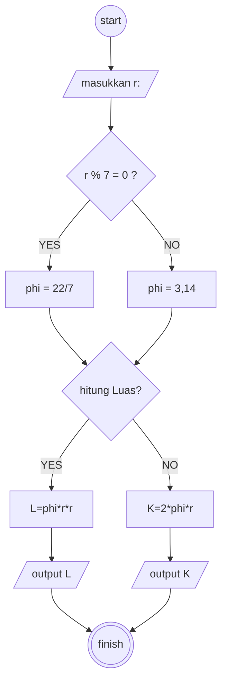

# Flowchart

```mermaid

flowchart TD
    start((start))

    input[/masukkan r:/]

    check1{r % 7 = 0 ?}

    proc1[phi = 22/7]
    proc2[phi = 3,14]

    check2{hitung Luas?}

    proc3[L=phi*r*r]
    proc4[K=2*phi*r]

    out1[/output L/]
    out2[/output K/]

    finish(((finish)))


    start --> input
    input --> check1
    check1-- YES -->proc1
    check1 -- NO -->proc2

    proc1-->check2
    proc2-->check2

    check2 -- YES --> proc3
    check2 -- NO --> proc4

    proc3 --> out1
    proc4 --> out2

    out1-->finish
    out2-->finish


```
