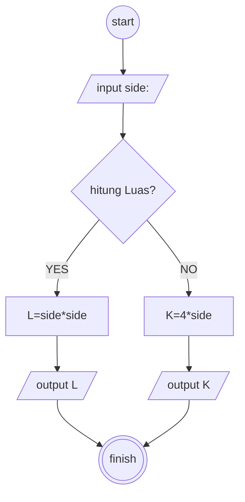

# Hitung Luas & Keliling Persegi

```mermaid

flowchart TD
    start((start))

    input[/input side:/]


    check1{hitung Luas?}

    proc1[L=side*side]
    proc2[K=4*side]

    out1[/output L/]
    out2[/output K/]

    finish(((finish)))

    start --> input
    input --> check1
    check1 -- YES --> proc1
    check1 -- NO --> proc2
    proc1 -->out1
    proc2-->out2
    out1-->finish
    out2-->finish
```
